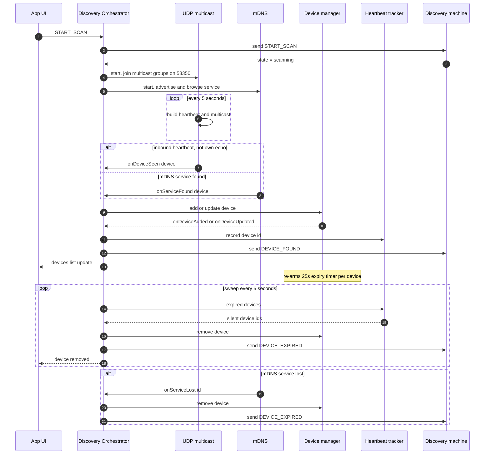
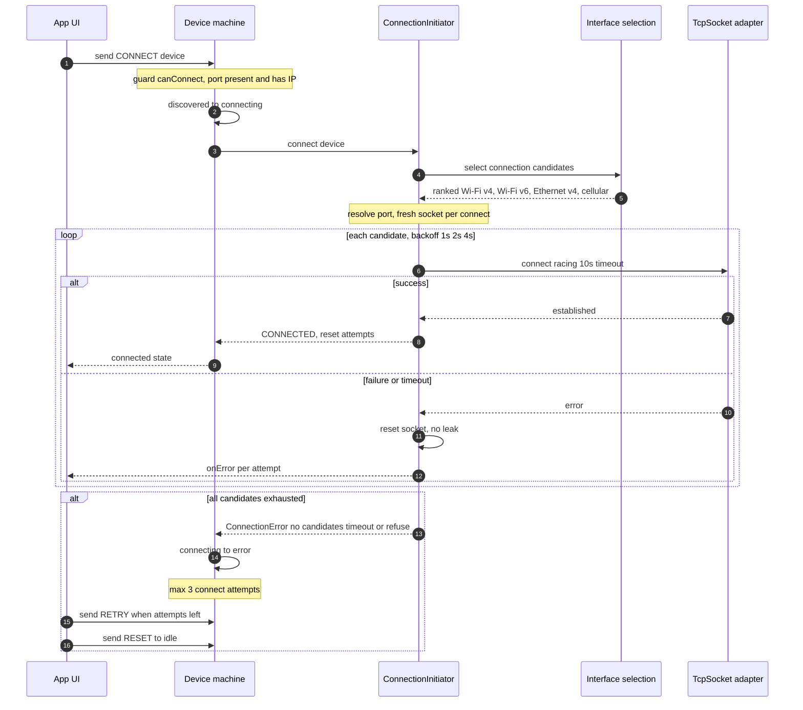
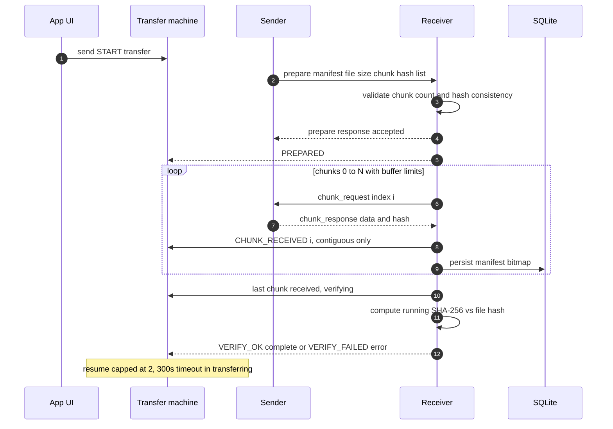

# PairSync End-to-End Flow

This document walks the complete lifecycle of a PairSync interaction — from a
device joining the Wi-Fi network to successfully sending and receiving a file —
and shows how the pieces of `@pairsync/core` wire together.

> **Status:** Stages 0–2 (interface detection, UDP multicast + mDNS discovery,
> device list management) and Stage 4 (TCP connection initiation) are
> **implemented and tested** in `packages/core`. Stages 3, 5, 6 and 7 are
> **planned** (Phase 3 transfer engine, Phase 4 trust + security). Where a
> stage is planned the behavior is the design target, not shipped code.

---

## Stage 0 — Join the network & enumerate interfaces

**Implemented** (`packages/core/src/network/interfaces.ts`, platform detection in
`packages/core/src/utils/platform.ts`).

When a device joins the Wi-Fi network it gets an IP via DHCP. PairSync does not
attempt multicast until it knows which addresses are actually usable:

1. **Platform detection** — `getPlatform`/`isMobile`/`isDesktop` decide which
   adapter to use.
2. **`InterfaceDetector` contract** (`interfaces.ts:44`) abstracts OS
   enumeration. Each app implements it: react-native-netinfo on mobile, a
   Rust/Tauri plugin on desktop.
3. **`filterInterfacesForAdvertisement`** (`interfaces.ts:144`) cleans the raw
   detect output through three gates:
   - **Adapter-name exclusion** — `lo|tun|tap|ppp|utun|wg|ipsec|vpn` are dropped
     wholesale (`EXCLUDED_INTERFACE_NAMES`, `interfaces.ts:79`). This removes
     VPN tunnels and loopback.
   - **Locality filter** — only RFC1918/APIPA IPv4 (`private`, `linkLocal`) and
     link-local/ULA IPv6 (`linkLocal`, `uniqueLocal`) survive (`LOCAL_RANGES`,
     `interfaces.ts:82`; `isLocalAddress`, line 108). Public/global, mapped, and
     malformed addresses are never usable.
   - **Canonicalization** — IPv6 zone IDs (`fe80::1%en0`) are stripped
     (`normalizeAddress`, `interfaces.ts:119`); a scope only identifies an
     interface on the host that owns it.
4. Interfaces left with no usable addresses are dropped.

The result is the `interfaces` array stored on a `Device`. Note `preferred` is
preserved but **never** the basis for reachability — the connect side re-derives
everything from actual IPs.

---

## Stage 1 — Announce presence & discover peers

**Implemented:** UDP (`packages/core/src/discovery/udp.ts`) and mDNS
(`packages/core/src/discovery/mdns.ts`). Manual IP entry planned (task 2.8).

Three tiers; the app runs the first two in parallel and falls back to manual
entry.

### Tier 1 — UDP multicast (`MulticastDiscovery`)

- **Join** — `start()` joins `224.0.0.1` and `ff02::1`, both on
  `DISCOVERY_PORT` = 53350 (`MULTICAST_GROUPS`, `udp.ts:32`). A failed join on
  one group is reported via `onError` but never stops the other (`udp.ts:148-166`).
- **Announce** — one heartbeat immediately, then every
  `HEARTBEAT_INTERVAL` = 5s (`udp.ts:169-177`). Each send fetches a _fresh_
  payload via the `heartbeat` callback so interface changes propagate.
- **Payload** — JSON built by `buildHeartbeat` (`network/heartbeat.ts:56`); the
  `type: "heartbeat"` discriminator is appended **last** so a runtime payload
  can never override the wire type. Fields: `device_id`, `alias`, `platform`,
  `interfaces`, `port`, optional `cert_fingerprint`.
- **Receive** — inbound datagrams are decoded + validated against
  `heartbeatSchema` (`heartbeat.ts:25`). Invalid messages raise
  `HeartbeatParseError` and are dropped; discovery keeps running. **Own echoes
  are dropped** by comparing against the captured `ownDeviceId`
  (`udp.ts:235-247`). Valid devices surface via `onDeviceSeen(device)`.
- **Concurrency guards** (`udp.ts:117-208`) — a stop during start rolls back
  partial group membership; a slow send can never overlap itself.

### Tier 2 — mDNS (`MdnsDiscovery`)

Advertises `_pairsync._tcp.local` (`SERVICE_TYPE`, `protocol/constants.ts:13`)
with a TXT record and browses for the same service type. Found/lost events
arrive via `onServiceFound`/`onServiceLost`, with own-service dedupe and
lifecycle cleanup mirroring the UDP engine. When a platform cannot provide
mDNS, callers skip Tier 2. (Adapter: `react-native-zeroconf` mobile /
`mdns-sd` crate-based Tauri plugin on desktop.)

### Tier 3 — Manual IP entry (task 2.8, planned)

User types `IP:port`; the app validates reachability and feeds a `Device`
straight into the `DeviceManager` — reusing the same connection path as
discovered devices.

### Why three tiers?

No single mechanism reliably works on every LAN, so each tier covers a
different network reality at a rising implementation cost:

- **Tier 1 — UDP multicast (custom).** Cheap, app-specific, one protocol loop
  to build; works on the plain same-subnet case. But it is trivially blocked by
  **AP/client isolation**, guest Wi-Fi, and enterprise networks, and it carries
  no hostname.
- **Tier 2 — mDNS (standard, RFC 6762).** Interoperates with the surrounding
  ecosystem (Bonjour reporting, `.local` names), and on iOS it is part of the
  Local-Network permission story. Still **link-local scope** — it dies at
  subnet boundaries, which is exactly why the cross-subnet **repeater**
  (task 2.7) was deferred to post-MVP: it needs an always-on host a phone
  cannot provide.
- **Tier 3 — manual IP entry.** The failsafe. When both discovery paths are
  blocked, a user who sees the peer's IP in the router's client list can still
  pair. Nearly free to build because it reuses the normal connection path
  (task 2.8).

The layering is **complementary, not redundant** — the failure modes are
**partly independent**; both UDP multicast and mDNS depend on local-network
multicast and permissions, so AP/client isolation, guest Wi-Fi, firewalls, and
permission policies may block both — manual IP entry is the fallback when
either or both discovery methods fail. Ordering also matches cost and UX:
multicast first because it is the highest-value/lowest-effort path, manual last
because it degrades UX (a person must type an address) and is therefore the
last resort.

Same-subnet coverage (1 + 2) ships first; the repeater's cross-subnet promise
waits until there is a home for an always-on relay.

---

## Stage 2 — Device list maintenance

**Implemented** (`packages/core/src/discovery/deviceManager.ts` +
`packages/core/src/state/machines/discoveryMachine.ts`).

Discovery engines hand `onDeviceSeen` devices to the `DeviceManager`, which owns
the canonical in-memory device list:

- **Deduplication** — keyed by `device_id` (`deviceManager.ts:32`).
- **Change detection** — `isMeaningfullyDifferent` (line 167) compares
  alias/platform/port/cert + a **key-order-independent** deep compare of
  `interfaces` (via `fast-deep-equal`). `last_seen_at` is excluded — it changes
  every heartbeat.
- **Lease/expiry** — every add/update re-arms a `HEARTBEAT_TIMEOUT` = 25s timer
  (`5 × 5s`, `armTimer`, line 135). A silent device fires `onDeviceRemoved`;
  mDNS additionally removes immediately from `onServiceLost`.
- **Callbacks** — `onDeviceAdded` / `onDeviceUpdated` / `onDeviceRemoved` feed
  the UI and the state machines.

The **`discoveryMachine`** (`discoveryMachine.ts:71-97`) is deliberately
declarative — no timers or sockets of its own:

```text
idle →(START_SCAN)→ scanning
scanning: DEVICE_FOUND (new id) ⇒ addDevice
          DEVICE_EXPIRED (tracked) ⇒ removeDevice
          STOP_SCAN ⇒ idle
          CLEAR ⇒ still scanning
```

`DEVICE_FOUND`/`DEVICE_EXPIRED` are sent by the **Discovery Actor** (the
orchestrator driving the engines + `HeartbeatTracker`), so platform timers never
leak into the state machine.

---

## Stage 3 — Pairing & trust (Phase 4, planned)

A discovered device is not yet proven to be who it claims. Phase 4 adds:

1. **Identity keypair** (tasks 4.1/4.3) — a long-term **X25519 identity key** per
   device, generated on first launch, stored in OS keychain (mobile) / encrypted
   file (desktop), rotatable (4.4).
2. **QR pairing** (4.8/4.9) — the payload carries device info + the **identity
   public key** + expiry. Manual payload entry (4.11) covers no-scanner cases.
3. **TOFU** (4.2) — first contact trusts the peer's identity key; later
   connections auto-trust only if the presented key matches the stored one.
4. **Session-key fingerprint** (4.U1) — _after_ the handshake, both screens show
   a fingerprint of the **derived session key** (not the identity key) to compare
   in person, catching a mistyped/misscanned QR payload.

---

## Stage 4 — Connection establishment

**Implemented** (`packages/core/src/discovery/connection.ts`), complemented by
`packages/core/src/state/machines/deviceMachine.ts`.

### Endpoint ordering — `selectConnectionCandidates` (`interfaces.ts:162`)

Every address in the peer's heartbeat becomes a candidate with priority:

```text
priority = INTERFACE_TYPE_PRIORITY[type] × 2 + ADDRESS_FAMILY_PRIORITY[family]
INTERFACE_TYPE_PRIORITY: Wi-Fi 0, Ethernet 1, Cellular 2, Other 3
ADDRESS_FAMILY_PRIORITY: ipv4 0, ipv6 1
```

Ordering is therefore **Wi-Fi IPv4 > Wi-Fi IPv6 > Ethernet IPv4 > Ethernet IPv6 > Cellular > Other**, ties broken by interface index. Only already-filtered local addresses are candidates.

### The connect loop — `ConnectionInitiator.connect` (`connection.ts:171`)

1. **Fresh socket per call** — `createSocket()` (`connection.ts:182`). Each
   connection owns its own socket, so concurrent connects to different devices
   never interfere.
2. **Port resolution** — `resolvePort` (line 135): the device's advertised port,
   otherwise **53350** (fallback for malformed advertised ports).
3. **Per-attempt timeout** — `connectWithTimeout` (line 237) races
   `socket.connect(host, port)` against `CONNECTION_TIMEOUT` = 10s. On timeout
   the socket is reset (`closeBestEffort`, line 267) so no half-open state leaks
   into the next candidate.
4. **Backoff** — `connectionBackoffDelay(n)` (`interfaces.ts:200`) = `1s × 2^n`
   between attempts: 1s, 2s, 4s, …
5. **Failure surfacing** — per-attempt failures call `onError`; the loop keeps
   the `ConnectionError.code` and underlying socket error.

### Terminal failure (`connection.ts:73-92`)

A typed `ConnectionError` (never a bare throw):

- **`no_candidates`** — no reachable endpoint advertised.
- **`timeout`** — a candidate swallowed the full 10s.
- **`connect_failed`** — refused/unreachable.

`EstablishedConnection` (line 95) hand back `{ deviceId, address, port, socket,
connectedAt, close }` — the socket is passed to the transfer engine.

### The `deviceMachine` around it (`state/machines/deviceMachine.ts`)

```text
idle →(START_SCAN)→ scanning →(DEVICE_DISCOVERED)→ discovered
discovered →(CONNECT, guard canConnect)→ connecting
connecting →(CONNECTED)→ connected
connecting →(CONNECT_FAILED | after 10s)→ error
error →(RETRY, guard canRetry)→ connecting   (max 3 attempts)
error →(RESET)→ idle
discovered/scanning →(DEVICE_LOST)→ scanning/idle
```

- `canConnect` (line 44) requires `port > 0` and at least one interface with a
  real IP — a `preferred` flag alone is not reachability.
- `canRetry` (line 51) caps consecutive attempts at `MAX_CONNECT_ATTEMPTS = 3`;
  beyond that only `RESET` to `idle`.

---

## Stage 5 — Secure handshake (Phase 4, planned)

**Design decision** (`IMPLEMENTATION_PLAN.md:145`): no TLS.
`react-native-quick-crypto` provides X25519/SHA-256/HKDF/AES-256-GCM but no
native TLS adapter, and cert-TOFU would duplicate QR trust. The sole scheme is
**application-level crypto over plaintext TCP**, layered on the Stage-4 socket.
Four hardening requirements (`IMPLEMENTATION_PLAN.md:581-590`):

1. **Forward secrecy + KCI resistance (Noise KK)** (4.6) — a fresh **ephemeral** X25519 keypair per session; handshake follows **Noise KK pattern** (mutual static-key authentication via QR): `ee = ECDH(eph_A, eph_B)`, `es = ECDH(eph_A, id_B)`, `se = ECDH(id_A, eph_B)`, `ss = ECDH(id_A, id_B)`; session key = `HKDF(ee || es || se || ss)`. A leaked identity key cannot decrypt past sessions, and **KCI is prevented** by the Noise KK pattern's property that an attacker without the victim's static private key cannot complete the handshake even with a compromised peer's static key.
2. **AEAD envelope** (4.7/4.13) — every message is `{ nonce, ciphertext }` with a
   HKDF-derived per-session nonce counter; re-key before the nonce space or the
   ~64 GiB GCM data limit. Nonce reuse is catastrophic and must fail closed.
3. **Key confirmation + transcript binding** (4.6) — both sides prove they
   derived the same key (confirm MAC); the transcript binds identity keys +
   nonces, preventing mid-handshake swap and key-compromise impersonation (KCI).
4. **Post-handshake fingerprint** (4.U1) — compare the _session-key_ fingerprint
   in person.

Framing stays as established in Phase 3: **length-prefixed binary** on native
TCP, **JSON/base64** on the web WebSocket path. The envelope is applied to each
message before framing. The `X-Cert-Fingerprint` header (`constants.ts:44`) **will be renamed to** `X-Identity-Fingerprint` (identities, not certs) **as part of Phase 4 identity work**.

---

## Stage 6 — Transfer protocol (Phase 3, planned; wire format implemented + tested)

The wire messages exist today in `packages/core/src/protocol/schemas.ts`; the
transport engine that drives them is Phase 3.

### Messages (`MESSAGE_TYPES`, `constants.ts:48`)

| Type               | Direction         | Payload (key fields)                                                                                                                                        |
| ------------------ | ----------------- | ----------------------------------------------------------------------------------------------------------------------------------------------------------- |
| `prepare`          | sender → receiver | `transfer_id`, `file_id`, `file_name`, `file_size`, `chunk_size`, `total_chunks`, `hash_algorithm`, `file_hash`, `chunk_hashes[]`, `mime_type`, `timestamp` |
| `prepare_response` | receiver → sender | `{ transfer_id, accepted, reason? }`                                                                                                                        |
| `chunk_request`    | receiver → sender | `{ transfer_id, chunk_indices[] }` (never empty)                                                                                                            |
| `chunk_response`   | sender → receiver | `{ transfer_id, chunk_index, data(b64), hash }`                                                                                                             |
| `resume`           | receiver → sender | `{ transfer_id, chunk_bitmap[] }`                                                                                                                           |

- Every schema validates its discriminator + shape; `chunkResponseSchema`
  decodes base64 back to `Uint8Array` (`schemas.ts:89-110`).
- **Manifest self-consistency** (`schemas.ts:52`) — `total_chunks` must equal
  `chunk_hashes.length` and `ceil(file_size/chunk_size)`. A mismatch means the
  receiver would wait for chunks the sender can never produce. Zero-byte files
  ⇒ 0 chunks.
- Builders append the discriminator **last**; `buildChunkResponse` (line 161)
  streams base64 through `base64-js`'s fixed-size writer, avoiding quadratic
  string building for multi-MiB payloads. `buildTransferMessage` (line 183) is
  the one-call dispatch.

### The flow

1. **Prepare** — the sender picks a transfer port from `TRANSFER_PORTS`
   (53351–53360), computes `file_hash` + per-chunk SHA-256s, sends `prepare`.
   The receiver validates the manifest and returns `prepare_response`.
2. **Stream** — the receiver asks for chunks (`chunk_request [0,1,2,…]`), the
   sender answers with `chunk_response`. Buffer limits **50 MB mobile /
   200 MB desktop**; **max 4 concurrent transfers, 2 concurrent resumes**.
3. **Chunk accounting** — the `transferMachine` (`transferMachine.ts`)
   advances only the **contiguous next-index** (`isNextChunk`, line 47);
   sparse/duplicate/out-of-range arrivals are ignored, fail-closed. The final
   contiguous chunk transitions to `verifying`; a zero-chunk transfer goes
   straight there too.
4. **Resume** — `RESUME` (bitmap) is allowed only from `error`, with
   `resumeAttempts < MAX_RESUME_ATTEMPTS` (2-resume cap). It restores the
   contiguous count from the bitmap; manifests persist to SQLite (task 3.13) so
   resume survives restarts.
5. **Timeout** — `after: TRANSFER_TIMEOUT` (300s) in `transferring` trips to
   `error` (`transferMachine.ts:143-145`).
6. Clipboard (3.8) and folder trees (3.9, batched manifests) reuse the engine.

---

## Stage 7 — Verification & teardown

- **Verify** — the receiver hashes the assembled file and compares to
  `file_hash` → `VERIFY_OK ⇒ COMPLETE` / `VERIFY_FAILED ⇒ error`
  (`transferMachine.ts:147-152`). Any corrupted or truncated chunk surfaces as a
  failed hash; resume only re-requests missing pieces.
- **Terminal states** — `complete`, `cancelled`, `error` are final. `error`
  exits only via `RESUME` (≤2) or `CANCEL`.
- **Close** — `EstablishedConnection.close()` (`connection.ts:106`) delegates to
  `socket.close()`. Per-connect socket ownership means closing one session never
  disturbs others.
- **Next round trip** — discovery keeps heartbeating every 5s, so the pair
  stays listed and can open a fresh Stage-4 connection + fresh Stage-5 session
  key for the next transfer.

---

## Actor wiring diagrams

The Discovery Actor is the glue between the engines, the device manager, the
heartbeat tracker, the XState machines, and the UI.

### 1. Discovery wiring — engines → DeviceManager → machines → UI


### 2. Connection wiring — tap → deviceMachine → ConnectionInitiator → socket


### 3. Transfer wiring — Phase 3 (planned, wire schemas shipped)


---

## Shipped vs. planned at a glance

| Stage | Area                                                         | Status                                       |
| ----- | ------------------------------------------------------------ | -------------------------------------------- |
| 0     | Interface detection & advertisement filtering                | ✅ Implemented + tested                      |
| 1     | UDP multicast + mDNS discovery; manual IP                    | 🚧 Manual IP is task 2.8; rest done          |
| 2     | Device list, expiry, discovery machine                       | ✅ Implemented + tested                      |
| 3     | QR pairing, TOFU, identity keys                              | 🚧 Planned (Phase 4)                         |
| 4     | TCP connection initiation + device machine                   | ✅ Implemented + tested                      |
| 5     | Crypto handshake (ECDH→HKDF→AES-GCM, no TLS)                 | 🚧 Planned (Phase 4)                         |
| 6     | Transfer engine (prepare/chunk/resume/verify) + wire schemas | 🚧 Schemas shipped; engine planned (Phase 3) |
| 7     | Hash verification, teardown, resume persistence              | 🚧 Planned (Phase 3)                         |

> Wire schemas and builders (`prepare`/`chunk`/`resume`) ship in Phase 1;
> transfer/security _engines_ arrive in Phases 3–4.

---

## Related

- `packages/core/CONTEXT.md` — core package domain vocabulary, constants,
  testing summary
- [`docs/state-machines.md`](./state-machines.md) — the three XState machines
  in detail
- `IMPLEMENTATION_PLAN.md` — phase/task breakdown and the transport decision
