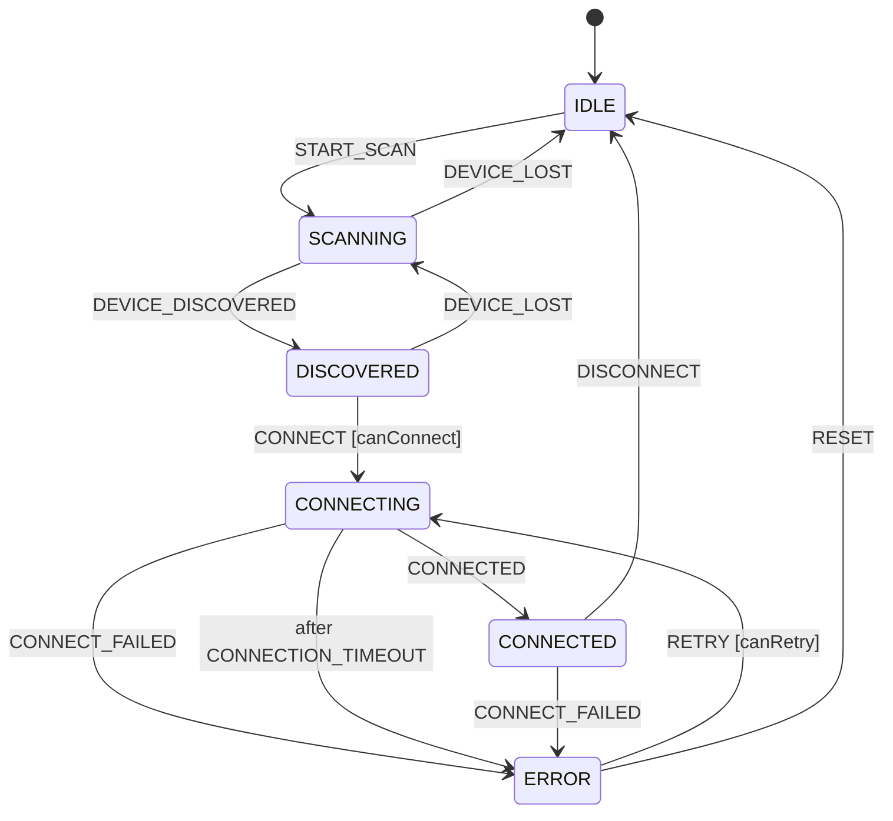
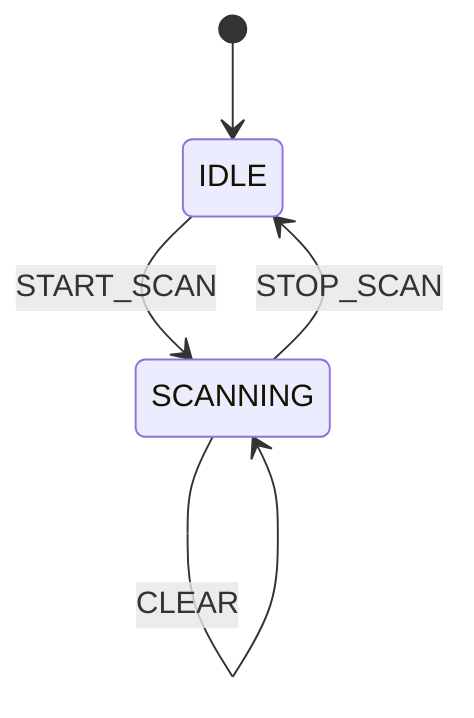
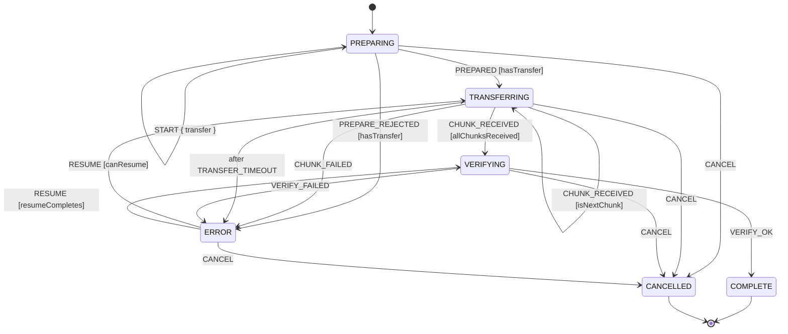

# State Machine Designs (Phase 1.1)

This document is the design reference for the three core XState v5 machines
implemented in `packages/core/src/state/machines/`. Each section covers the
state diagram, the states, the events/transitions, and the guards.

> **Status:** Implemented as executable XState v5 machines with transition
> tests (`packages/core/src/__tests__/*.test.ts`). Diagrams below are Mermaid
> renderings; the machines themselves are the source of truth.

---

## 1. Device Machine — `deviceMachine.ts`

Lifecycle of a single peer device: scan → discover → connect → connected,
with failure and retry handling.

### State Diagram

### States

| State      | Meaning                                                            |
| ---------- | ------------------------------------------------------------------ |
| `IDLE`     | No scan in progress, no tracked device.                            |
| `SCANNING` | Actively scanning; devices appear here.                            |
| `DISCOVERED` | A candidate device was found; waiting for the user to connect.   |
| `CONNECTING` | Handshake in flight; bounded by `CONNECTION_TIMEOUT`.            |
| `CONNECTED` | Active connection established.                                     |
| `ERROR`    | A connect attempt failed; retryable up to `MAX_CONNECT_ATTEMPTS`.  |

### Events

`START_SCAN` · `DEVICE_DISCOVERED { device }` · `DEVICE_LOST` ·
`CONNECT { device }` · `CONNECTED` · `CONNECT_FAILED { reason }` ·
`DISCONNECT` · `RETRY` · `RESET`

### Guards

| Guard        | Passes when                                                        |
| ------------ | ------------------------------------------------------------------ |
| `canConnect` | Device has `port > 0` and at least one interface with an IP or `preferred`. |
| `canRetry`   | `connectAttempts < MAX_CONNECT_ATTEMPTS` (initial connect counts as attempt 1). |

### Context

`device: Device | null` · `lastError: string | null` · `connectAttempts: number`

---

## 2. Discovery Machine — `discoveryMachine.ts`

Owns the scan lifecycle and the in-memory device list. The socket/mDNS work
itself lives in the discovery actor (Phase 1.3); this machine is the
declarative state owner.

### State Diagram

### States

| State      | Meaning                                                       |
| ---------- | ------------------------------------------------------------- |
| `IDLE`     | Not scanning; device list empty, `scanStartedAt` null.        |
| `SCANNING` | Scan in progress; devices are added/removed here.             |

### Events

`START_SCAN` · `STOP_SCAN` · `DEVICE_FOUND { device }` ·
`DEVICE_EXPIRED { deviceId }` · `CLEAR`

### Guards

| Guard            | Passes when                                          |
| ---------------- | ---------------------------------------------------- |
| `isNewDevice`    | `device_id` not already in the tracked list.         |
| `isTrackedDevice`| `deviceId` exists in the tracked list.               |

### Context

`devices: Map<string, Device>` · `scanStartedAt: number | null`

---

## 3. Transfer Machine — `transferMachine.ts`

Lifecycle of a single file/clipboard transfer, including the resume cap for
failed transfers.

### State Diagram

### States

| State         | Meaning                                                       |
| ------------- | ------------------------------------------------------------- |
| `PREPARING`   | Handshake with the receiver; `START` loads transfer metadata. |
| `TRANSFERRING`| Streaming chunks; bounded by `TRANSFER_TIMEOUT`.              |
| `VERIFYING`   | Hash verification of the assembled payload.                   |
| `COMPLETE`    | Final — verified and done.                                    |
| `ERROR`       | Terminal failure; resumable up to `MAX_RESUME_ATTEMPTS`.      |
| `CANCELLED`   | Final — user or system cancelled.                             |

### Events

`START { transfer }` · `PREPARED` · `PREPARE_REJECTED { reason }` ·
`CHUNK_RECEIVED { chunkIndex }` · `CHUNK_FAILED { reason }` ·
`VERIFY_OK` · `VERIFY_FAILED { reason }` · `RESUME { chunksReceived }` ·
`CANCEL`

### Guards

| Guard              | Passes when                                                          |
| ------------------ | -------------------------------------------------------------------- |
| `hasTransfer`      | A `START` has been received (`context.transfer !== null`).           |
| `isNextChunk`      | The event's chunk is the next contiguous index (`chunkIndex === chunksReceived`) and in range (`< total_chunks`). |
| `allChunksReceived`| The contiguous final chunk (`chunkIndex === total_chunks - 1`) arrived. |
| `canResume`        | Resume count in `[0, total_chunks)` and `resumeAttempts < MAX_RESUME_ATTEMPTS` (2-resume cap). |
| `resumeCompletes`  | Resume count `=== total_chunks` and `resumeAttempts < MAX_RESUME_ATTEMPTS` — straight to verifying. |

### Context

`transfer: Transfer | null` · `chunksReceived: number` ·
`resumeAttempts: number` · `lastError: string | null`

---

## Design decisions

- **Chunk progress is strictly contiguous.** `CHUNK_RECEIVED` only advances
  progress when the event's index equals `chunksReceived` and is in range —
  sparse, duplicate, negative, or out-of-range events are ignored, so an
  incomplete transfer can never be marked complete. Resume counts are
  bounds-checked the same way.
- **Timeouts are declarative.** `CONNECTION_TIMEOUT` (device) and
  `TRANSFER_TIMEOUT` (transfer) use XState `after` delays, so no timer
  bookkeeping leaks into actors.
- **Retry caps are explicit constants.** `MAX_CONNECT_ATTEMPTS = 3` (device)
  and `MAX_RESUME_ATTEMPTS = 2` (transfer) are exported and unit-tested.
- **Discovery is actor-driven.** The machine is the state owner; the actor
  (Phase 1.3) does the actual socket/mDNS work and feeds events in —
  including stale-device expiry via `DEVICE_EXPIRED`. The machine carries
  no sweep timer of its own.
